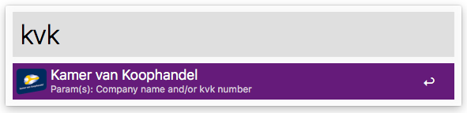

# JCID\Kamer van Koophandel

An Alfred workflow to easily open the search for a company name and/or kvk number.

**Note**: You will need the Alfred [Powerpack](https://www.alfredapp.com/powerpack/) to use this workflow - which is commercial software. Check out the [Alfred app](https://www.alfredapp.com/) website.

## Usage

The keyword to trigger the search in Alfred is `kvk` by default.

### Examples

|Search|Alfred opens|
| ------------- | ------------- |
|`kvk jcid`|[Search for 'JCID'](https://www.kvk.nl/orderstraat/bedrijf-kiezen/?q=jcid)|
|`kvk 55456545`|[Search for kvk number '55456545'](https://www.kvk.nl/orderstraat/bedrijf-kiezen/?q=55456545)|

## Download

Download the Alfred workflow via the URL

- http://alfred-workflow.jcid.nl/kvk

## License

This is licensed under [MIT License](LICENSE).
